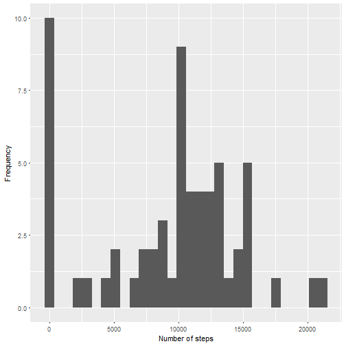
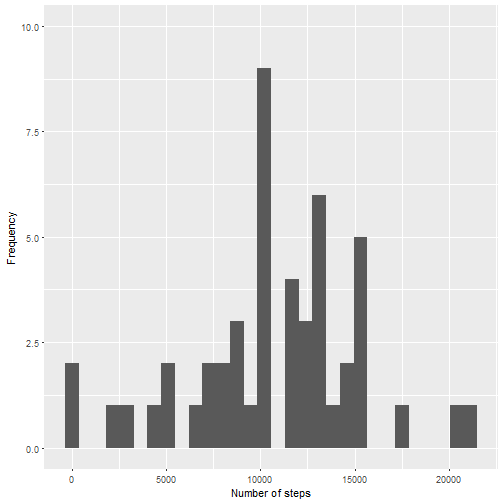

##Reproducible Research : Peer Assessment 1
##Author : Tom Luijten

###Load the required packages

```r
library(dplyr)
library(ggplot2)
library(lattice)
```

###Loading and preprocessing the data
First of all, let's load the data:

```r
activity <- read.csv(file="activity.csv", header=TRUE, sep=",")
```


```r
activity$date <- as.Date(activity$date, "%Y-%m-%d") 
```

### Calculating the mean total number of steps taken per day
Calculate the total number of steps taken per day

```r
grp <- group_by(activity, date)
totalday <- summarise(grp, sum = sum(steps,na.rm = TRUE))
```

Make a histogram of the total number of steps taken each day

```r
qplot(x = sum, data = totalday, ylim = c(0,10))+
  geom_histogram() +
  labs(x = "Number of steps", y = "Frequency")
```

```
## `stat_bin()` using `bins = 30`. Pick better value with `binwidth`.
## `stat_bin()` using `bins = 30`. Pick better value with `binwidth`.
```



Calculate the mean and median of the total number of steps taken per day

```r
meansum <- mean(totalday$sum, na.rm= TRUE)
mediansum <- median(totalday$sum, na.rm= TRUE)
```
The mean of the total number of steps taken per day is equal to 9354.2295082 and the median is equal to 10395.

### Calculate the average daily activity pattern
Calculate average number of steps taken in each 5 minute interval

```r
grp <- group_by(activity, interval)
averageinterval <- summarise(grp, steps = mean(steps,na.rm = TRUE))
plot(x = averageinterval$interval, averageinterval$steps, type = "l", xlab =  "5-minute interval", ylab = "Average number of steps")
```


```r
averageinterval$interval[which(averageinterval$steps == max(averageinterval$steps))]
```

```
## [1] 835
```
The 5-minute interval which contains the maximum number of steps across all the days in the dataset, is the 835 interval.

### Imputing missing values
Calculate and report the total number of missing values in the dataset

```r
sum(is.na(activity$steps))
```

```
## [1] 2304
```
The total number of missing values in the dataset is equal to 2304.

Replace missing values by the mean for that 5-minute interval and create the activity2 interval that contains the resplaced values.

```r
activity2 <- activity
for (i in 1:nrow(activity2)) {
  if (is.na(activity2[i,"steps"])) {
    activity2[i,"steps"] <- mean(activity[activity2$interval == activity2[i,"interval"],"steps"],na.rm = TRUE)
  }
}
```

Make a histogram of the total number of steps taken each day

```r
grp2 <- group_by(activity2, date)
totalday2 <- summarise(grp2, sum = sum(steps,na.rm = TRUE))
qplot(x = sum, data = totalday2, ylim = c(0,10))+
  geom_histogram() +
  labs(x = "Number of steps", y = "Frequency")
```

```
## `stat_bin()` using `bins = 30`. Pick better value with `binwidth`.
## `stat_bin()` using `bins = 30`. Pick better value with `binwidth`.
```

```
## Warning: Removed 1 rows containing missing values (geom_bar).

## Warning: Removed 1 rows containing missing values (geom_bar).
```



Calculate the mean and median of the total number of steps taken per day

```r
meansum2 <- mean(totalday2$sum)
mediansum2 <- median(totalday$sum)
```
The mean of the total number of steps taken per day is equal to 1.0766189 &times; 10<sup>4</sup> and the median is equal to 10395.
From this, it can be concluded that replacing the missing values by means has an effect on the total mean but not on the median. 

### The differences in activity patterns between weekdays and weekends
Create a new factor variable in the dataset with two levels – “weekday” and “weekend” indicating whether a given date is a weekday or weekend day.

```r
activity2$weekdayend <- ifelse(weekdays(activity2$date) %in% c("maandag","dinsdag","woensdag","donderdag","vrijdag"), "weekday", "weekend")
```

Make a panel plot containing a time series plot of the 5-minute interval and the average number of steps taken, averaged across all weekday days or weekend days.

```r
grp3a <- group_by(activity2[activity2$weekdayend == "weekday",], interval)
averageinterval3a <- cbind(summarise(grp3a, steps = mean(steps,na.rm = TRUE)),"weekday")
names(averageinterval3a) <- c("interval","meansteps", "weekdayend")
grp3b <- group_by(activity2[activity2$weekdayend == "weekend",], interval)
averageinterval3b <- cbind(summarise(grp3b, steps = mean(steps,na.rm = TRUE)),"weekend")
names(averageinterval3b) <- c("interval","meansteps", "weekdayend")
averagewde <- rbind(averageinterval3a,averageinterval3b)

xyplot(averagewde$meansteps ~ averagewde$interval | averagewde$weekdayend, 
       layout = c(1, 2), 
       type = "l", 
       xlab = "Interval", 
       ylab = "Number of steps")
```


